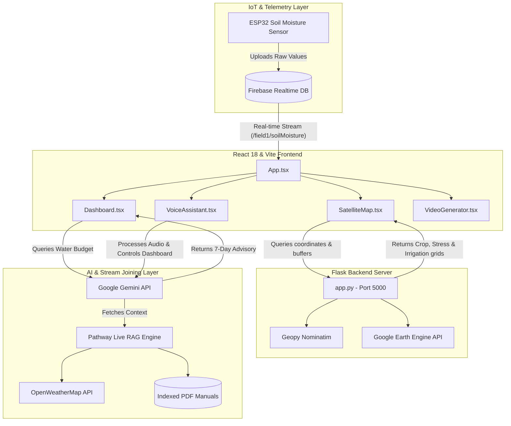

# Agroflow V2 - Smart Agriculture & Water Advisory System

Agroflow V2 is an AI-driven, automated crop type classification, moisture stress detection, and 8-day irrigation advisory system across crop growth stages. By fusing moderate-resolution spectral signatures (optical and microwave satellite data from Copernicus Sentinel-1 and Sentinel-2) with live IoT sensor feeds, local weather streams, and agronomic manuals, Agroflow optimizes water consumption and delivers localized advice to farmers.

---

## 🏛️ Architecture Overview

The following diagram illustrates how the AgroFlow ecosystem joins live data, satellite feeds, machine learning, and Generative AI:



---

## 🛠️ Technology Stack

| Layer | Technologies |
| :--- | :--- |
| **Frontend** | React 18, Vite, TypeScript, Tailwind CSS, Lucide Icons |
| **Mapping & Charts** | Leaflet, React-Leaflet, Recharts |
| **Generative AI** | Google GenAI SDK (Gemini & Veo), Pathway Stream RAG |
| **IoT & Telemetry** | Firebase SDK, ESP32 Realtime Integration |
| **Backend Frameworks** | Flask (Python), Scikit-Learn, Geopy (Nominatim), Google Earth Engine (`ee` Python SDK) |

---

## 📁 Project Directory Structure

```
agroflow/
├── backend/
│   └── app.py             # Google Earth Engine, geocoding & tessellated mapping service (Port 5000)
├── components/            # Frontend UI components
│   ├── AIModal.tsx        # High-importance alert advisory details
│   ├── AlertCenter.tsx    # Banner section for water & crop stress alerts
│   ├── CalendarTab.tsx    # Farmer schedule and irrigation calendar UI
│   ├── Charts.tsx         # Recharts components for water budgets & sensor trends
│   ├── CropLayer.tsx      # Leaflet layers visualizing crop classification zones
│   ├── Dashboard.tsx      # Core system monitor and Pathway stream integration
│   ├── FarmerProfile.tsx  # Initial onboarding, telemetry bounds, & Firebase config
│   ├── IrrigationLayer.tsx# Leaflet layers visualizing water deficit recommendations
│   ├── SatelliteMap.tsx   # Base interactive Leaflet map interface
│   ├── SeasonalGuidance.tsx# Growth-stage agronomy planner
│   ├── SensorAnalysis.tsx # Real-time sensor stream view and stage updating controls
│   ├── Sidebar.tsx        # Navigation menu
│   ├── StressLayer.tsx    # Leaflet layers visualizing soil moisture stress index
│   ├── VideoGenerator.tsx # Google Veo crop simulation animation UI
│   ├── VoiceAssistant.tsx # Gemini multimodally-triggered interactive assistant
│   └── WaterBudgetForm.tsx# Custom configuration editor for water variables
├── services/              # External service connectors
│   ├── agroflowService.ts # Flask backend fetch APIs
│   ├── firebase.ts        # ESP32 realtime moisture stream listener & mapping
│   ├── gemini.ts          # Gemini SDK integration for vision models and budgeting
│   └── pathway.ts         # Live Pathway RAG query simulator with weather join
├── utils/                 # Utility scripts
│   ├── audioUtils.ts      # Web Audio API handlers for voice recorder
│   └── geminiHelper.ts    # Secure API Key retriever
├── App.tsx                # Main state controller, live loops, and page router
├── constants.ts           # Fallback parameters and constants
├── index.html             # Base HTML template
├── index.tsx              # React mounting root
├── translations.ts        # Multi-language dictionary (English, Hindi, Hebrew)
├── types.ts               # Shared TypeScript typings
└── .env.example           # Configuration template for local API keys
```

---

## 🌟 Key Components & Features

### 1. 🛰️ Satellite Crop Monitoring
Queries Harmonized Sentinel-2 (optical) and Sentinel-1 (microwave SAR) data via Google Earth Engine within a 5km buffer of the farm.
* **Crop Classification**: Simulates a Random Forest classifier mapping 25 organic subdivisions (Overall Accuracy: $88.5\%$, Kappa coefficient: $0.82$).
* **Microwave Data**: Utilizes Sentinel-1 GRD SAR backscatter ($VV$, $VH$, $VH/VV$) to determine canopy thickness and water properties independent of cloud cover.

### 2. 💧 Stage-Aware Moisture Stress Detection
Combines spectral vegetation indices with local sensors to determine water stress across growth phases (Germination, Seedling, Vegetative, Flowering, Fruiting, Maturity, Harvest).
* Uses Vegetation Condition Index ($VCI$) and Soil Moisture Index ($SMI$) to flag water-stressed zones in real-time.

### 3. 🤖 Pathway Multi-Stream RAG Engine
Coordinates multi-stream joins:
* Ingests local weather streams (temperature, humidity, forecast, wind speed) from OpenWeatherMap.
* References indexed PDF farming guidelines and manuals uploaded in the Pathway library.
* Matches current crop parameters dynamically to generate contextually grounded irrigation guidelines.

### 4. 🔌 Real-Time ESP32 Telemetry
Links directly to a physical ESP32 soil moisture sensor using the Firebase Realtime Database.
* Dynamically calibrates raw capacitive/resistive voltage readings ($0$ to $4095$) to a clamped $0\% - 100\%$ soil moisture percentage based on custom hardware ranges.

### 5. 🎙️ Gemini AI Voice Assistant
Offers an interactive, multilingual voice control center powered by Gemini.
* Supports speech-to-text and text-to-speech feedback in English (EN), Hindi (HI), and Hebrew (HE).
* Can toggle virtual irrigation pumps, update profile coordinates, add calendar reminders, and change system languages through verbal commands.

### 6. 🎥 Veo AI Video Preview Generation
Creates a simulated video preview of the farm's crop growth stages and environment using Google Veo, providing visual verification of crop health.

---

## 📊 Algorithmic Framework

### Reference Evapotranspiration ($ET_c$)
The daily water requirement is calculated using the crop coefficient approach:
\[ET_c = ET_0 \times K_c\]
Where:
* \(ET_c\) is the crop evapotranspiration (water consumption rate).
* \(ET_0\) is the reference evapotranspiration (derived from Pathway joined weather data).
* \(K_c\) is the stage-specific crop coefficient (e.g., $1.15$ for Vegetative Wheat, $0.3$ for Fallow).

### Remote Soil Moisture & Vegetation Indices
* **Vegetation Condition Index ($VCI$):**
  \[VCI = NDVI \times 100\]
* **Soil Moisture Index ($SMI$):**
  \[SMI = NDWI \times 100\]

### 8-Day Irrigation Water Deficit
The volume deficit is computed weekly against root-zone water balance and rainfall:
\[Deficit = \max(0, ET_{c, 8\text{-day}} - (\text{Rainfall} + \text{Soil Contribution}))\]
Where:
* \(\text{Soil Contribution} = SMI \times ET_{c, 8\text{-day}} \times 0.5\)

---

## 🚀 How to Run the App Locally

### 1. Prerequisites
Ensure you have the following installed on your machine:
* **Node.js** (v18 or higher)
* **Python** (v3.9 or higher)

### 2. Running the Backend Server (Flask)
The Flask backend handles geocoding, queries Google Earth Engine, and creates mapping zones.

1. Navigate to the `backend/` directory:
   ```bash
   cd backend
   ```
2. Install the required Python packages:
   ```bash
   pip install flask flask-cors geopy earthengine-api
   ```
3. Run the Flask server:
   ```bash
   python app.py
   ```
   *The server will start and listen on `http://127.0.0.1:5000`.*

### 3. Running the Frontend Dashboard (React + Vite)
1. Navigate back to the root directory of the project:
   ```bash
   cd ..
   ```
2. Install Node dependencies:
   ```bash
   npm install
   ```
3. Configure your environment variables:
   * Copy `.env.example` to `.env.local`
   * Open `.env.local` and add your valid `GEMINI_API_KEY`:
     ```env
     VITE_GEMINI_API_KEY=your_gemini_api_key_here
     ```
4. Start the Vite development server:
   ```bash
   npm run dev
   ```
   *Open `http://localhost:5173` in your browser to view the interactive dashboard.*

